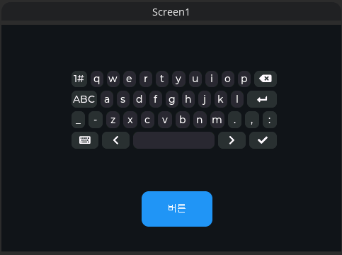

## 보드 설정 모음. 

# 1.WT32-SC01

- Similiar display from DFRobot uses ILI9488 (not ST7796S)
- Graphics & Touch Driver : [LovyanGFX](https://github.com/lovyan03/LovyanGFX)
- UI/Widgets : [LVGL8.3.6](https://github.com/lvgl/lvgl)
- Framework : Arduino + PlatformIO ([ESP-IDF sample here](https://github.com/sukesh-ak/LVGL8-WT32-SC01-IDF)) 

 Board config
- TFT (ST7796)
    - TFT_RST=22
    - TFT_SCLK=14
    - TFT_DC=21
    - TFT_CS=15
    - TFT_MOSI=13
    - TFT_MISO=-1
    - TFT_BCKL=23
- Touch	(FT6336U)
    - TOUCH_SDA=18
    - TOUCH_SCL=19
    - I2C_TOUCH_ADDRESS=0x38

