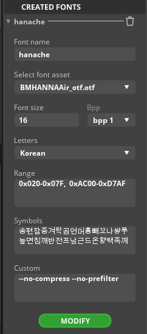

# -LVGLPersonal-Data

### 스퀘어 라인과 LVGL 설정 자료들. 

## 1.스퀘어 라인과 LVGL과 관련된 기본 설정 자료를 모으는 곳. 

---

## 2.보드들 (/boards)
esp32 : WT32_SC01 (Plus아님)
stm32 : STM32F429I-DISC1

---

### 스퀘어 라인에서 한글 폰트 설정 

 Range : __0x020-0x07F,  0xAC00-0xD7AF__

 
 Letters : Korean
 
---

### 추천하는 링크들
1.lvgl과 피그마를 이용한 디자인 적용 유튜버
https://www.youtube.com/watch?v=VwGUaCZ3xvE
